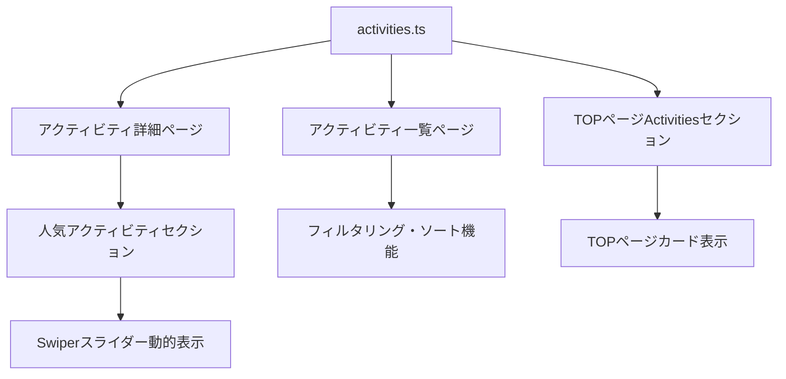

# アクティビティページシステム

## アクティビティページシステム

### 概要

TOPページ完成後の第二フェーズとして、アクティビティの一覧ページと詳細ページを実装。Astroのファイルベースルーティングと動的ルーティング機能を活用した構造を採用。

### 実装済み構造

#### ページ構成
- **一覧ページ**: `/activities/` - 全アクティビティのリスト表示
- **詳細ページ**: `/activities/[slug]` - 個別アクティビティの詳細情報表示

#### データ管理システム
```typescript
// src/data/activities.ts
export interface Activity {
  slug: string;                    // URL用識別子
  title: string;                   // アクティビティ名
  category: string;                // カテゴリ分類
  description: string;             // 概要説明
  images: {
    thumbnail: string;             // 一覧用サムネイル
    hero: string;                  // 詳細ページメイン画像
    gallery: string[];             // ギャラリー画像配列
  };
  
  // フィルタリング・ソート対応データ
  targetAge: { min: number; max?: number };  // 対象年齢
  season: string[];                          // 実施時期
  capacity: { min: number; max: number };    // 参加人数
  duration: number;                          // 所要時間（分）
  price: { adult: number; child?: number };  // 料金設定
  weather: string[];                         // 実施可能天気
  
  // 詳細ページ専用データ
  highlights: string[];            // おすすめポイント
  program: Array<{time: string; content: string}>; // プログラム流れ
  notes: string[];                 // 注意事項
  bookingUrl?: string;             // 予約リンク
}
```

#### 実装済みアクティビティデータ
1. **SUP体験** (`sup-experience`) - 水上体験・初心者向け・人気アクティビティ
2. **キャンプファイヤー体験** (`campfire-experience`) - 自然体験・ファミリー向け・人気アクティビティ
3. **レンタルサイクル** (`rental-cycle`) - 陸上体験・自由度高
4. **樹海トレイル** (`forest-trail`) - 自然体験・ガイド付き

### 動的ルーティング実装

#### 詳細ページ (`[slug].astro`)
```astro
export async function getStaticPaths() {
  return activities.map((activity: Activity) => ({
    params: { slug: activity.slug },
    props: { activity }
  }));
}

const { activity } = Astro.props;
const pageTitle = `${activity.title} | クワルビリゾート`;
```

### レイアウト継承
- **共通レイアウト**: TOPページと同じSidebar・BottomBar・Footer構成
- **BottomBar動作**: 下層ページでは常時表示（TOPページのスクロール連動なし）
- **モーダル**: VideoModal・BookingModalも全ページで利用可能

## データ連動システムの詳細設計

### 1. データフローの全体像



### 2. 中央データ管理システム (`src/data/activities.ts`)

**データ構造の設計思想:**
```typescript
// 完全な型定義によるデータ整合性確保
export interface Activity {
  // 基本情報（必須）
  slug: string;                    // URL生成・ルーティング用
  title: string;                   // 表示名・SEO用
  category: string;                // カテゴリ分類・フィルタ用
  description: string;             // 概要・メタ情報用
  
  // 画像管理（最適化対応）
  images: {
    thumbnail: string;             // 一覧・カード表示用
    hero: string;                  // 詳細ページメイン画像
    gallery: string[];             // 詳細ページギャラリー用
  };
  
  // フィルタリング・検索対応データ
  targetAge: { min: number; max?: number };  // 年齢フィルタ用
  season: string[];                          // 季節フィルタ用
  capacity: { min: number; max: number };    // 人数フィルタ用
  duration: number;                          // 時間フィルタ・表示用
  price: { adult: number; child?: number };  // 価格ソート・表示用
  weather: string[];                         // 天気フィルタ用
  
  // 表示制御フラグ
  isPopular: boolean;              // 人気アクティビティ表示制御
  isRecommended?: boolean;         // おすすめ表示制御（将来実装）
  isNew?: boolean;                 // 新着表示制御（将来実装）
  
  // UI表示用データ
  badges: Array<{                  // 動的バッジ表示用
    type: 'reservation' | 'group' | 'beginner' | 'advanced';
    text: string;
  }>;
  
  // 詳細ページ専用データ
  highlights: string[];            // おすすめポイント
  about: {                         // 詳細情報
    duration: string;              // 表示用時間文字列
    targetAge: string;             // 表示用年齢文字列
    season: string;                // 表示用季節文字列
  };
  program: Array<{                 // プログラム流れ
    time: string;
    content: string;
  }>;
  notes: string[];                 // 注意事項
  bookingUrl?: string;             // 予約システム連携用
}
```

### 3. 動的ルーティングとデータ連携

**詳細ページ (`[slug].astro`) の実装パターン:**
```astro
---
import { activities, type Activity } from '../../data/activities.ts';

// 1. 静的パス生成（ビルド時）
export async function getStaticPaths() {
  return activities.map((activity: Activity) => ({
    params: { slug: activity.slug },     // URLパラメータ
    props: { activity }                  // ページpropsとして渡す
  }));
}

// 2. Props型定義
interface Props {
  activity: Activity;
}

const { activity } = Astro.props;

// 3. SEO・メタ情報の動的生成
const pageTitle = `${activity.title} | クワルビリゾート`;
const pageDescription = activity.description;

// 4. 人気アクティビティのフィルタリング（現在ページ除外）
const popularActivities = activities
  .filter(act => act.isPopular && act.slug !== activity.slug)
  .slice(0, 6); // 最大6件表示

// 5. パンくずナビゲーション用データ生成
const breadcrumbItems = [
  { text: 'TOP', href: '/' },
  { text: 'アクティビティ', href: '/activities' },
  { text: activity.title } // 現在ページ（リンクなし）
];
---

<Layout title={pageTitle} description={pageDescription}>
  <!-- パンくず -->
  <Breadcrumb items={breadcrumbItems} />
  
  <!-- メインコンテンツ（動的データ表示） -->
  <h1>{activity.title}</h1>
  <p>{activity.description}</p>
  
  <!-- 詳細情報（aboutオブジェクトから） -->
  <dl>
    <dt>所要時間</dt><dd>{activity.about.duration}</dd>
    <dt>対象年齢</dt><dd>{activity.about.targetAge}</dd>
    <dt>実施時期</dt><dd>{activity.about.season}</dd>
  </dl>
  
  <!-- バッジ表示（動的生成） -->
  {activity.badges.map((badge) => (
    <span class={`badge badge--${badge.type}`}>
      {badge.text}
    </span>
  ))}
  
  <!-- 人気アクティビティセクション（Swiperと連携） -->
  <section class="activities-popular">
    <div class="activities-popular__swiper">
      <div class="swiper-wrapper">
        {popularActivities.map((popularActivity) => (
          <div class="swiper-slide">
            <!-- 動的カード生成 -->
            <ActivityCard activity={popularActivity} />
          </div>
        ))}
      </div>
    </div>
  </section>
</Layout>
```

### 4. 一覧ページへの応用パターン

**一覧ページ (`activities/index.astro`) での実装予想:**
```astro
---
import { activities } from '../data/activities.ts';

// 1. カテゴリ別分類
const categories = [...new Set(activities.map(act => act.category))];

// 2. フィルタリング用データ準備
const filterOptions = {
  categories: categories,
  seasons: [...new Set(activities.flatMap(act => act.season))],
  priceRanges: [
    { label: '〜5,000円', min: 0, max: 5000 },
    { label: '5,001〜10,000円', min: 5001, max: 10000 },
    { label: '10,001円〜', min: 10001, max: Infinity }
  ]
};

// 3. 初期表示用（人気順ソート）
const defaultActivities = activities
  .sort((a, b) => {
    if (a.isPopular && !b.isPopular) return -1;
    if (!a.isPopular && b.isPopular) return 1;
    return a.price.adult - b.price.adult; // 価格順
  });
---

<Layout title="アクティビティ一覧">
  <!-- フィルタUI -->
  <aside class="filter-panel">
    <select data-filter="category">
      {categories.map(cat => <option value={cat}>{cat}</option>)}
    </select>
    <!-- 他のフィルタ... -->
  </aside>
  
  <!-- アクティビティグリッド -->
  <main class="activities-grid" data-activities={JSON.stringify(activities)}>
    {defaultActivities.map((activity) => (
      <ActivityCard activity={activity} />
    ))}
  </main>
</Layout>

<script>
  // クライアントサイドフィルタリング
  const activitiesData = JSON.parse(
    document.querySelector('[data-activities]').dataset.activities
  );
  
  function filterActivities(filters) {
    return activitiesData.filter(activity => {
      // カテゴリフィルタ
      if (filters.category && activity.category !== filters.category) return false;
      
      // 価格フィルタ
      if (filters.priceMax && activity.price.adult > filters.priceMax) return false;
      
      // 季節フィルタ
      if (filters.season && !activity.season.includes(filters.season)) return false;
      
      return true;
    });
  }
</script>
```

### 5. TOPページとの連携

**TOPページActivitiesセクションでの活用:**
```astro
---
// 人気アクティビティのみ抽出（最大4件）
const featuredActivities = activities
  .filter(activity => activity.isPopular)
  .slice(0, 4);
---

<section class="top-activities">
  <div class="top-activities__swiper">
    <div class="swiper-wrapper">
      {featuredActivities.map((activity) => (
        <div class="swiper-slide">
          <a href={`/activities/${activity.slug}`}>
            <h3>{activity.title}</h3>
            <p>¥{activity.price.adult.toLocaleString()}〜</p>
          </a>
        </div>
      ))}
    </div>
  </div>
</section>
```

### 6. データ連動システムの利点

**1. 一元管理によるメリット:**
- データ変更時は`activities.ts`のみ更新すれば全ページに反映
- 型安全性により、データ構造変更時のエラーを事前検出
- 重複データなし、整合性保証

**2. スケーラビリティ:**
- 新しいアクティビティ追加は配列への追加のみ
- フィルタ条件追加は型定義拡張で対応
- CMS統合時もインターフェース維持で移行容易

**3. パフォーマンス:**
- 静的サイト生成により高速表示
- 必要な分のみクライアントサイドJS実行
- 画像最適化との組み合わせで最適パフォーマンス

**4. 保守性:**
- コンポーネント化により再利用促進
- 統一されたデータアクセスパターン
- 型定義による開発体験向上

### 今後の実装予定
- **詳細ページ**: 画像ギャラリー（Swiper）・予約システム連携
- **TOPページ連携**: ActivitiesセクションからのリンクとMoreButton経由遷移
- **ソート機能**: 価格順・人気順などの並び替え機能（将来実装）

### 設計の利点
1. **型安全性**: TypeScript型定義でデータ整合性保証
2. **一元管理**: activities.tsで全アクティビティ情報を管理
3. **拡張性**: CMS統合時もインターフェース維持で移行容易
4. **SEO対応**: 各詳細ページが独立URL・メタ情報設定済み
5. **保守性**: TOPページの設計パターン踏襲で一貫した開発体験